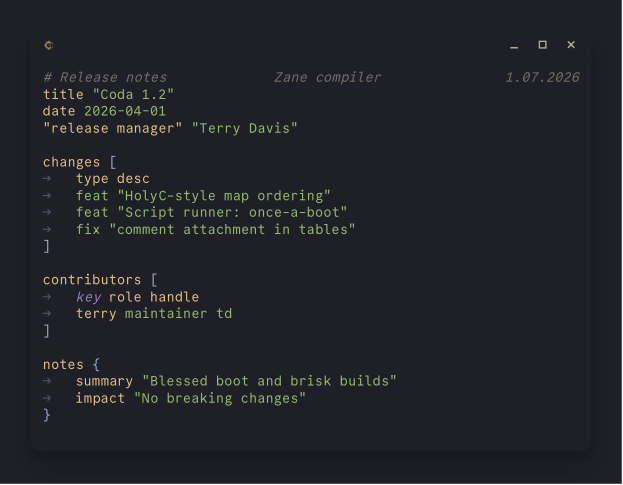

#  <br> Coda



A compact configuration format designed to be easily read- and writeable. The name comes from music — a coda is the concluding passage that ties a composition together. A `.coda` file is the single source of truth for configuration.

The above file in JSON:


---

## What is Coda?

* Whitespace-sensitive, line-oriented.
* Every leaf value is a string; interpretation is left to the consumer.
* Quotes are optional unless a value contains whitespace or syntax characters (`{}[]"#`).
* Comments are preserved and attach to the node that follows them.

Coda has three structural constructs: **blocks** `{}`, **arrays** `[]`, and **tables** (inferred from array headers). For the full language specification, see [`docs/SPEC.md`](docs/SPEC.md).

---

## Installation

**Python** — install the pre-built package from PyPI (includes the compiled native library):

```bash
pip install coda-format
```

```python
import coda

with coda.Doc.parse_file("config.coda") as doc:
    print(doc.root()["key"])
```

**C++** — Coda is a **header-only library**. Copy or symlink `include/coda.hpp` and `#include` it directly — no build step required.

```cpp
#include "path/to/coda.hpp"
```

**C FFI / other languages** — build the shared library with `just build` (see [Building & testing](#building--testing) below).

---

## API documentation

| API | File |
|---|---|
| C++ header (`include/coda.hpp`) | [`docs/API-CPP.md`](docs/API-CPP.md) |
| Python bindings (`bindings/python/coda.py`) | [`docs/API-PYTHON.md`](docs/API-PYTHON.md) |
| C FFI (`ffi/coda_ffi.h`) | [`docs/API-C-FFI.md`](docs/API-C-FFI.md) |

---

## Building & testing

This repo is built and tested inside a [Devbox](https://www.jetify.com/devbox)
environment (which pins zig, just, python3, dune and ocaml). `just` recipes are
thin wrappers around `scripts/tasks.py`.

```bash
devbox run -- just test         # run all tests (C++, C FFI, Python, OCaml)
devbox run -- just generate     # regenerate include/coda.hpp (requires quom)
devbox run -- just build        # build host shared library (libcoda_ffi.so)
devbox run -- just cross-all    # cross-compile for all supported targets
devbox run -- just test-cpp
devbox run -- just test-c-ffi
devbox run -- just test-py-ffi
devbox run -- just test-ocaml
```

> `include/coda.hpp` is a generated single-header amalgamation (git-ignored);
> the build recreates it on demand. The source of truth is `src/`.
>
> All four language test suites are driven by a single catalog,
> `tests/catalog/catalog.coda`. To add a test, edit that file. See
> [`contributing/`](contributing/README.md).

Cross-compiled FFI artifacts are placed under `dist/<target>/`.
